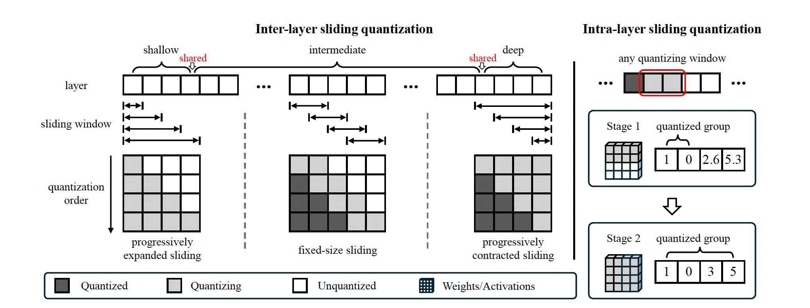
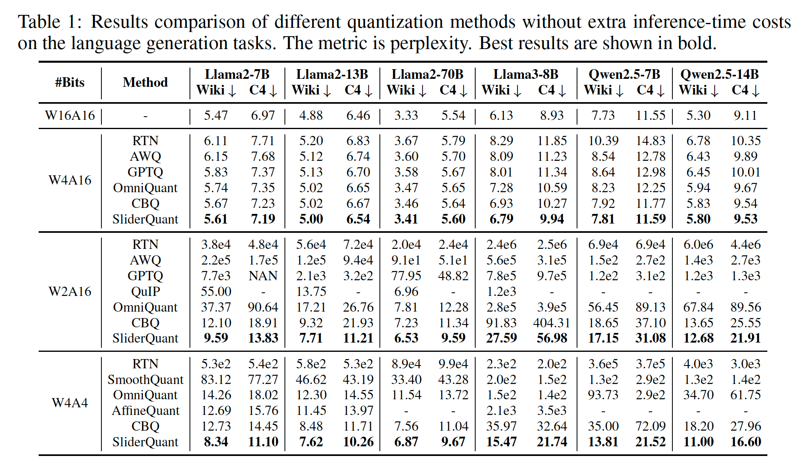
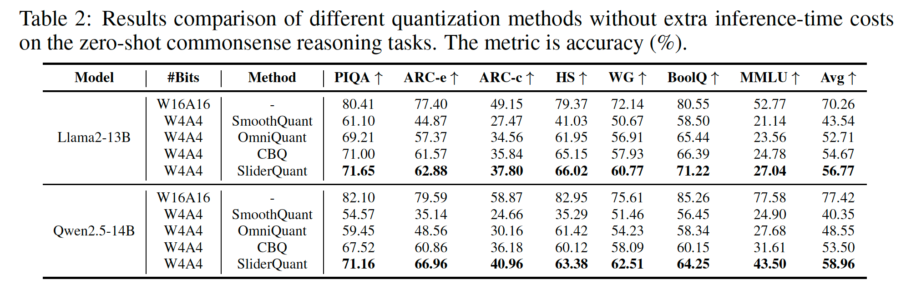
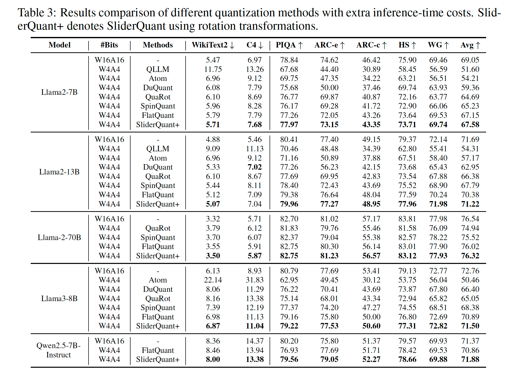
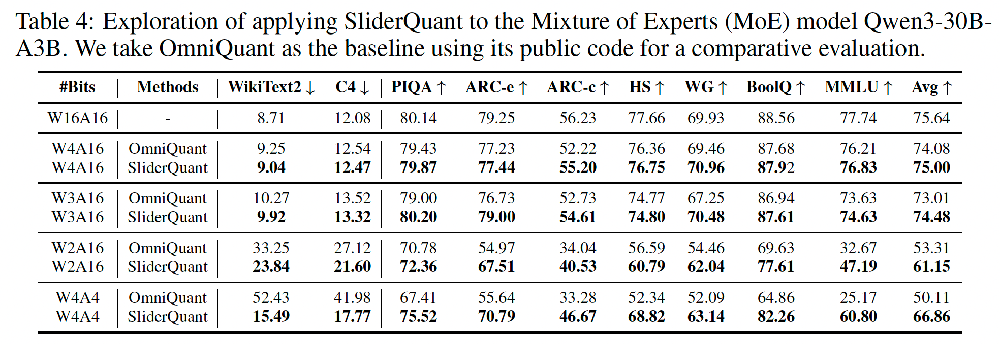
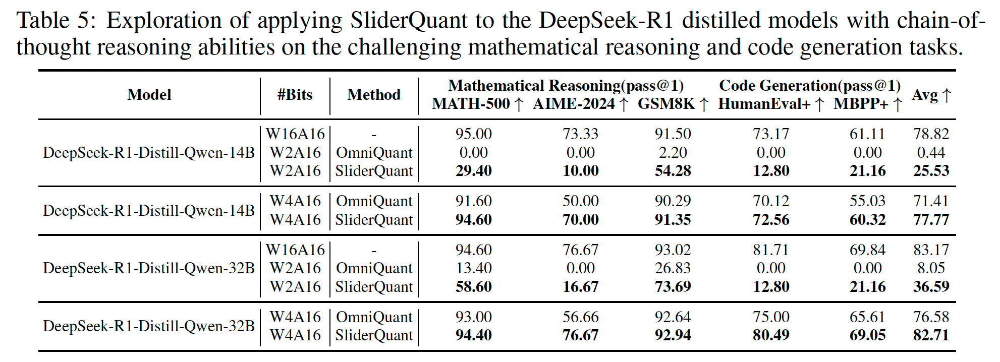

# SliderQuant: Accurate Post-Training Quantization for LLMs

<div align="center">
<a href="https://deep-optimization.github.io/sliderquant/"></a>&nbsp;<a href="#"></a>&nbsp;<a href="https://openreview.net/forum?id=YNqZqw4fLT"></a>&nbsp;<a href="https://huggingface.co/IntelLabsChina/SliderQuant"></a>

</div>

By Shigeng Wang, Chao Li, Yangyuxuan Kang, Jiawei Fan, Zhonghong Ou and Anbang Yao.

This repository is the official PyTorch implementation of "SliderQuant: Accurate Post-Training Quantization for LLMs", accepted to ICLR 2026.



We propose SliderQuant with two core designs:

- Inter-layer sliding quantization adapts the window shape across shallow, intermediate, and deep layers.
- Intra-layer sliding quantization progressively quantizes layers inside the current window.

## Table Of Contents

- [Main Results](#main-results)
- [Model Zoo](#model-zoo)
- [Install](#install)
- [How To Train](#how-to-train)
- [How To Test](#how-to-test)
- [Citation](#citation)
- [Acknowledgement](#acknowledgement)

## Main Results

#### Language Generation



#### Zero-Shot Commonsense Reasoning



#### Methods With Extra Inference-Time Cost



#### MoE Model Results



#### Math Resoning and Code Generation



## Model Zoo

The following checkpoints are planned for public release on Hugging Face:

| Model | Quantization | Hugging Face |
| --- | --- | --- |
| Llama2-13B | W4A4 | [SliderQuant-Llama2-13B-W4A4](https://huggingface.co/IntelLabsChina/SliderQuant/blob/main/llama2-13b-w4a4-slider_parameters.pth) |
| Llama2-13B | W2A16 | [SliderQuant-Llama2-13B-W2A16](https://huggingface.co/IntelLabsChina/SliderQuant/blob/main/llama2-13b-w2a16-slider_parameters.pth) |
| Qwen2.5-14B | W4A4 | [SliderQuant-Qwen2.5-14B-W4A4](https://huggingface.co/IntelLabsChina/SliderQuant/blob/main/qwen2.5-14b-w4a4-slider_parameters.pth) |
| Qwen2.5-14B | W2A16 | [SliderQuant-Qwen2.5-14B-W2A16](https://huggingface.co/IntelLabsChina/SliderQuant/blob/main/qwen2.5-14b-w2a16-slider_parameters.pth) |

All checkpoints are available under [IntelLabsChina/SliderQuant](https://huggingface.co/IntelLabsChina/SliderQuant).

## Install

```bash
git clone https://github.com/genggng/sliderquant

mamba create -n sliderquant python=3.10 -y
mamba activate sliderquant

cd sliderquant
pip install -e .

```

## How To Train

1. Create a folder and place the experimental configuration file inside, following this structure:

```text
sliderquant/
├── log-llama2
│   └── llama2-w4a4
│       └── config.yaml
```

1. Edit `task_list.conf` to specify the `result_dir`.

```bash
result_dir=configs/llama2-7b-w2a16

result_dir=${exp_id}
GPU_NUM=1
port=29507
THRESHOLD=0.05
WAIT_MODE=true
WAIT_INTERVAL=60
```

1. Start training:

```bash
./auto_train_ddp.sh
```

## How To Test

1. Edit `task_list.conf` to specify the `result_dir`.

```bash
result_dir=configs/llama2-7b-w2a16

GPU_NUM=1
port=29507
THRESHOLD=0.05
WAIT_MODE=true
WAIT_INTERVAL=60
```

1. Run evaluation:

```bash
./auto_test_one.sh
```

## Citation

If SliderQuant is useful in your research, please cite:

```bibtex
@inproceedings{wang2026sliderquant,
  title={SliderQuant: Accurate Post-Training Quantization for LLMs},
  author={Wang, Shigeng and Li, Chao and Kang, Yangyuxuan and Fan, Jiawei and Ou, Zhonghong and Yao, Anbang},
  booktitle={International Conference on Learning Representations},
  year={2026}
}
```

## Acknowledgement

SliderQuant builds code from:

- [OmniQuant](https://github.com/OpenGVLab/OmniQuant)
- [QuaRot](https://github.com/spcl/QuaRot)

Thank you to the authors and maintainers of both projects for making their code public.
